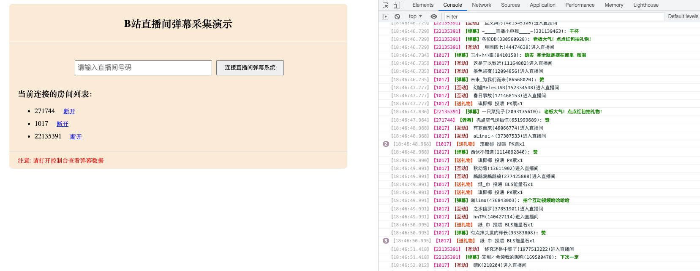

# danmaku.bilibili

B站直播间实时弹幕采集

## 项目背景

周末在家偶尔看到B站直播间有一个用弹幕玩的游戏，根据用户输入的弹幕内容进行的实时游戏，感觉挺不错的，于是就想做一个自己的弹幕游戏。

网上大概搜了一下，B 站没有提供相关 API，网上有用 python 爬虫实现的，但我作为一枚前端，首先想到的就是直接连接B站的 websocket 弹幕服务器，直接接收弹幕消息。

想法有了，于是就开干吧。整个过程其实就是把B站的相关js代码拉下来，然后将压缩版的js代码还原成接近源码的程度，这个过程其实没那么难，只是需要花一些时间。利用周末2天时间，基本上把弹幕的接收端调通了，可以实时接收直播间的弹幕消息。

接下来就是弹幕游戏的实现了，这个就比较简单了，因为已经能拿到实时弹幕内容了。

> 目前遇到的难点可能就是 await 代码不太好还原成源码，基本只能靠猜。因为 await 编译之后变成了 generator 的实现，中间的逻辑我还没分析出来。
>
> 不过，单靠猜基本也能还原个八九不离十。
>
> 感兴趣的可以查看下 analysis/await/ 目录下面的相关代码

## 如何使用？

### 方式一：使用在线服务

这种方式是通过在服务器部署一个 websocket 代理服务器，使用时只需要连接这个代理服务器，然后发送一些命令即可开启实时弹幕获取。

#### 使用方式

> 下面的示例是浏览器js代码，其他环境类似，都是通过 websocket 客户端连接到这个代理服务器，然后通过发送指令即可。
> 
> 目前的公共代理服务器地址为: [wss://blive.deno.dev](https://blive.deno.dev)  
> 支持私有部署(目前仅支持部署到 Deno Deploy)

```js
const socket = new WebSocket('wss://blive.deno.dev')

socket.addEventListener('open', () => {
    // 进入房间
    socket.send(JSON.stringify({
        cmd: 'enter',           // 命令
        rid: '123',               // 房间号
        events: ['DANMU_MSG'],  // 监听这个房间中的事件列表
    }))

    // 离开房间
    socket.send(JSON.stringify({
        cmd: 'leave',           // 命令
        rid: '123',               // 房间号
    }))
})

socket.addEventListener('message', ({data}) => {
    // 接收到的消息，格式为 { rid: '房间号', payload: {} }
    console.log(data)
})
```

支持的命令有：

- enter 进入房间，需要 rid 和 events 参数
- leave 离开房间，需要 rid 参数
- exit 退出所有房间

支持的 event 有：

|          事件名(大小写敏感)           |     说明      |
|:-----------------------------:|:-----------:|
|     COMMON_NOTICE_DANMAKU     |    公共通知     |
|          NOTICE_MSG           |    任务通知     |
|      STOP_LIVE_ROOM_LIST      |   停播直播间列表   |
|       HOT_RANK_CHANGED        |    热榜更新     |
|      HOT_RANK_CHANGED_V2      |    热榜更新     |
|    HOT_RANK_SETTLEMENT_V2     |    热榜结算     |
|           DANMU_MSG           |    普通弹幕     |
|       DANMU_AGGREGATION       |    聚合弹幕     |
|      SUPER_CHAT_MESSAGE       |   超级聊天消息    |
|    SUPER_CHAT_MESSAGE_JPN     |   超级聊天消息    |
| ROOM_REAL_TIME_MESSAGE_UPDATE |  直播间实时信息更新  |
|         INTERACT_WORD         |   直播间互动文字   |
|        WATCHED_CHANGE         |  直播间观看人数更新  |
|        ONLINE_RANK_V2         |  直播间高能用户排名  |
|       ONLINE_RANK_COUNT       |  直播间高能用户数   |
|       ONLINE_RANK_TOP3        | 直播间Top3高能用户 |
|         ENTRY_EFFECT          |    进入特效     |
|           GUARD_BUY           |    购买舰长     |
|           SEND_GIFT           |     送礼物     |
|          COMBO_SEND           |    连送礼物     |
|             LIVE              |    开始直播     |
|           PREPARING           |     准备中     |
|       PK_BATTLE_PRE_NEW       |     PK      |
|         WIDGET_BANNER         |     小部件     |
|     LIVE_INTERACTIVE_GAME     | 现场交互游戏(弹幕？) |

详细说明请阅读 [websocket重构](apis/refactor.md)。

Demo地址: https://blive.deno.dev

> 这个在线服务采用免费的 Deno Deploy 部署，**稳定性不能保证，仅用于测试**，后续如果有可靠的免费部署服务的话，会考虑切换。

### 方式二：本地浏览器内运行

1. 克隆项目

```shell
git clone git@github.com:champkeh/danmaku.bilibili.git
```

2. 安装依赖

```shell
pnpm i
```

3. 启动服务

> 该服务主要用来代理B站的相关接口，防止出现 CORS 错误

```shell
npm run start
```

4. 输入直播间 roomid 即可开始采集实时弹幕数据了(支持short id)，效果如下



默认监听直播间的【普通弹幕】、【文本交互】、【送礼物】以及【连接】和【断开】事件，想要监听更多消息，可以通过`addEventListener`添加更多类型的监听器。

比如，监听【进入特效】消息代码如下：

```js
socket.addEventListener('ENTRY_EFFECT', ({detail}) => {
    // 进入特效的数据 detail
})
```

目前可用的消息类型可以查看 [Events](https://github.com/champkeh/blive#events)

### 额外说明

由于建立 websocket 连接需要首先调用 http 接口获取`token`值(下面的原理部分有讲解)，而该 http 接口并未开启
CORS，所以这里需要启动一个本地代理服务器来处理跨域问题，如果需要部署到线上，则需要自行解决代理服务器的问题。

## 目录说明

下面是各个目录的说明：

- raw: 从b站获取的压缩版js文件，保留不动
- analysis: 对上面的压缩版js进行格式化，也可能会把一些文件拆成多个文件方便分析
- apis: b站网页调用的一些接口，后续看看能不能利用一下
- <del>source/ws: 最终还原出的源码，目前只关注 websocket 弹幕服务，后面如果要分析其他部分，可能会单独创建目录</del>
  该目录已迁移到单独的 [blive-ws](https://github.com/champkeh/blive) 进行维护，方便二次开发
- apps: 基于分析出来的源码做的一些案例

## 传输协议细节

首先根据房间号调用 HTTP 接口 `https://api.live.bilibili.com/xlive/web-room/v1/index/getDanmuInfo?id=${房间id}&type=0` 获取 `token`
、`host_list`等建立 websocket 连接所需的基本参数。

`host_list`是 websocket 断开后的重连服务列表，每次都会随机返回2个地址外加一个固定地址: `broadcastlv.chat.bilibili.com`。

`token`用于 websocket 连接建立之后进行用户认证，只有认证成功才会接收到数据。

下面是接口返回的示例：

```json
{
  "code": 0,
  "message": "0",
  "ttl": 1,
  "data": {
    "group": "live",
    "business_id": 0,
    "refresh_row_factor": 0.125,
    "refresh_rate": 100,
    "max_delay": 5000,
    "token": "t_E3lrIA1UuNvoz-NbFUN-h2P8Gw75hyBqpd_7bwSKKcMq6mfkTyfPhAummm4KSxdJxoXOxswzQHDMYQODTXqDgJM0qixkFcvzPmCUWQzLFDkK8PeDK4VqBcmLCD0kiYz9WZQLELZn1J5Wwg9pxVJa5-un5J2gOJgMfB7EJnlQ0CLg==",
    "host_list": [
      {
        "host": "ks-live-dmcmt-sh2-pm-03.chat.bilibili.com",
        "port": 2243,
        "wss_port": 443,
        "ws_port": 2244
      },
      {
        "host": "ks-live-dmcmt-sh2-pm-01.chat.bilibili.com",
        "port": 2243,
        "wss_port": 443,
        "ws_port": 2244
      },
      {
        "host": "broadcastlv.chat.bilibili.com",
        "port": 2243,
        "wss_port": 443,
        "ws_port": 2244
      }
    ]
  }
}
```

有了`token`，我们就可以建立 websocket 连接了，websocket 内部传输的数据为二进制 buffer 格式的数据，会经过下面这样的方式进行编码：

```js
// TextEncoder 默认是 UTF-8 编码
const body = new TextEncoder().encode(payload)
```

建立 websocket 连接之后，客户端需要发送 【Token认证包】进行认证，只有认证通过之后才能进行后续的通信。认证包采用的是 json 格式，如下所示：


前16个字节是消息头，后面会讲。接下来就是一个 json 字符串，结构为:

```json5
{
  // 用户id，为0时表示没有登录
  "uid": 0,
  // 房间id
  "roomid": 5440,
  // 协议版本，目前为3
  "protover": 3,
  // 所在平台，浏览器的话就是web
  "platform": "web",
  // 固定为2，目的不详
  "type": 2,
  // 上一步拿到的token
  "key": "",
}
```

如果认证成功，服务器会返回下面这样的包：


前16个字节同样是消息头，接下来是一个 json 字符串表示结果。`code`为 0 表示成功。

> 在实际测试过程中，如果认证失败，服务器不会回复任何消息

到这里，websocket 连接就算建立起来了。
接下来会设置一个定时器，每隔30秒发送一个心跳包：


因为心跳包会发送一个空对象`{}`，而这个空对象经过上面的编码之后会变成：


所以才会出现上面那些心跳包的数据部分都是`[object Object]`这个字符串。

接下来是时候讲一下消息头的格式了

### 二进制消息协议

websocket 传输的数据为二进制格式，如下所示：

```js
const ws = new WebSocket(url)
ws.binaryType = "arraybuffer"
```

### 消息(packet)编码结构


如上图所示，整个消息分为消息头 header 和消息体 body，header 部分占用16字节，内部包含5个字段：

```ts
interface PacketHeader {
    // 整个消息(包含header和body)所占字节数
    packetLen: int32

    // 消息头所占字节数，固定为16
    headerLen: int16

    // 协议版本，主要指body的压缩格式，取值为[0, 1, 3]
    // - 0表示业务通信消息，无压缩
    // - 1表示连接通信消息，无压缩 (比如心跳包、认证包等与业务无关的数据包)
    // - 3表示 Brotli 压缩，也就是浏览器中常见的 br 压缩算法
    protoVersion: int16

    // 操作码，当前共有5种操作码，见下面的 【操作码类型】
    op: int32

    // 消息序列号
    // 客户端发给服务器的包为1
    // 服务器发给客户端的包不确定
    seq: int32
}
```

> 关于压缩算法：
>
> 大部分现代浏览器都支持3种压缩算法：gzip / deflate / br  
> br 就指的是 Brotli 算法，这3种算法的比较可以阅读[这篇文章](https://www.siteground.com/blog/brotli-vs-gzip-compression/)

### 操作码类型

```js
const OPCODE = {
    // 心跳包
    WS_OP_HEARTBEAT: 2,

    // 心跳应答包
    WS_OP_HEARTBEAT_REPLY: 3,

    // 消息包
    WS_OP_MESSAGE: 5,

    // 用户认证包
    WS_OP_USER_AUTHENTICATION: 7,

    // 认证结果包
    WS_OP_CONNECT_SUCCESS: 8,
}
```

如果你仔细研究过ws里面传输的数据细节的话，可能会发现【心跳应答包】有一些特殊，如下所示：


这个结果其实是不满足上面的编码结构的，根据上面的编码结构解析 header 如下：

```json5
{
  packetLen: 20,
  headerLen: 16,
  protoVersion: 1,
  op: 3,
  seq: 0,
}
```

包总大小为20字节，但实际传输的却是35个字节。

我们根据上面心跳包知道，这个数据最后的`[object Object]`是服务器返回了一个空对象`{}`导致的。而 body 的前4个字节表示的当前房间的人气值。

另外，消息头加上这个人气值正好是20字节，也就是`header.packetLen`值，也就是说，心跳应答包其实不需要返回后面的空对象的(浪费15个字节的传输流量)。

### 消息体(body)编码结构

根据上面可知，body 分压缩和无压缩2个版本，其中无压缩的 body 编码格式为 UTF-8 编码的 JSON 字符串，Brotli 压缩版是在无压缩版的基础上进行的封装。

另外，一次传输的 buffer 可以编码多个 packet。

.svg)

.svg)

## 类似项目

- [Bilibili-Live-API](https://github.com/lovelyyoshino/Bilibili-Live-API)

## LICENSE

MIT
