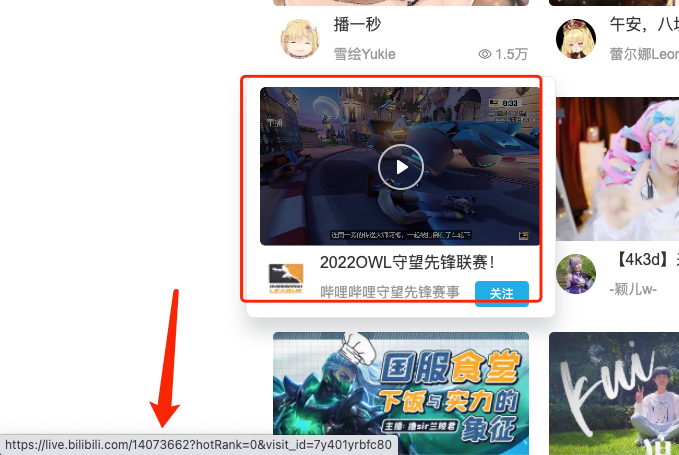

# danmaku.bilibili
B站直播间实时弹幕技术分析

## 缘起

周末在家偶尔看到B站直播间有一个用弹幕玩的游戏，根据用户输入的弹幕内容进行的实时游戏，感觉挺不错的，于是就想做一个自己的弹幕游戏。

网上大概搜了一下，B站没有提供相关API，网上有用python爬虫实现的，但我作为一枚前端，首先想到的就是直接连接B站的`websocket`弹幕服务器，直接接收弹幕消息。

想法有了，于是就开干吧。整个过程其实就是把B站的相关js代码拉下来，然后将压缩版的js代码还原成接近源码的程度，这个过程其实没那么难，只是需要花一些时间。利用周末2天时间，基本上把弹幕的接收端调通了，可以实时接收直播间的弹幕消息。

接下来就是弹幕游戏的实现了，这个就比较简单了，因为已经能拿到实时弹幕内容了。

> 目前遇到的难点可能就是await代码不太好还原成源码，基本只能靠猜。因为await编译之后变成了generator的实现，中间的逻辑我还没分析出来。
> 
> 不过，单靠猜基本也能还原个八九不离十。
> 
> 感兴趣的可以查看下`analysics/await/`目录下面的相关代码

## 直播间弹幕的传输协议

首先调用接口 `https://api.live.bilibili.com/xlive/web-room/v1/index/getDanmuInfo?id=${房间id}&type=0` 获取 `token`、`host_list`等建立`ws`所需的基本参数。

`host_list`用于轮训ws服务。

下面是一个接口返回示例：
```json
{
  "code": 0,
  "message": "0",
  "ttl": 1,
  "data": {
    "group": "live",
    "business_id": 0,
    "refresh_row_factor": 0.125,
    "refresh_rate": 100,
    "max_delay": 5000,
    "token": "t_E3lrIA1UuNvoz-NbFUN-h2P8Gw75hyBqpd_7bwSKKcMq6mfkTyfPhAummm4KSxdJxoXOxswzQHDMYQODTXqDgJM0qixkFcvzPmCUWQzLFDkK8PeDK4VqBcmLCD0kiYz9WZQLELZn1J5Wwg9pxVJa5-un5J2gOJgMfB7EJnlQ0CLg==",
    "host_list": [{
        "host": "ks-live-dmcmt-sh2-pm-03.chat.bilibili.com",
        "port": 2243,
        "wss_port": 443,
        "ws_port": 2244
      }, {
        "host": "ks-live-dmcmt-sh2-pm-01.chat.bilibili.com",
        "port": 2243,
        "wss_port": 443,
        "ws_port": 2244
      }, {
      "host": "broadcastlv.chat.bilibili.com",
      "port": 2243,
      "wss_port": 443,
      "ws_port": 2244
    }]
  }
}
```

## 二进制消息协议

### 消息编码结构


如上图所示，整个消息分为消息头 header 和消息体 body，header 部分占用16字节，内部包含5个字段：
- packetLen: 整个消息的字节大小，该字段本身占用4个字节
- headerLen: 消息头大小，固定为16，该字段占用2个字节
- ver: 协议版本号，当前为1，该字段占用2个字节
- op: 操作码，当前共有5种操作码，具体可以查看`ws/const.js`代码中的`WS_CODE`字典，该字段占用4个字节
- seq: 消息序列号，初始值为1，该字段占用4个字节

body 部分是变长的，采用 utf-8 进行编码。

### 消息解码结构

todo

## 客户端实现

参考 `ws` 目录下相关代码

## 如何使用？

1. 安装依赖
```shell
npm install
```

2. 启动代理服务器
> 主要是代理B站的相关接口
```shell
npm run start
```

3. 根据自己的需求修改`ws/client.js`文件中的房间ID(roomId)的值

4. 浏览器访问`ws/index.html`文件，查看控制台，即可看到该直播间的实时弹幕内容


## 关于 `roomId` 的获取

有的直播间页面地址栏上面显示的那个 id 不一定是真实的 roomId，比如下面这个地址：
```
https://live.bilibili.com/76?hotRank=0&visit_id=7y401yrbfc80
```
这个 76 明显不是 roomId，正常的 roomId 都至少是7位数，可以从列表页面看到真实的 roomId，如下图：



鼠标放在【2022OWL守望先锋联赛】上面，浏览器左下角会显示跳转链接，这个链接里面的 id 才是真实的 roomId。

> 后续看看是不是有接口可以根据直播间页面的那个id获取到真实的roomId

## LICENSE

MIT
