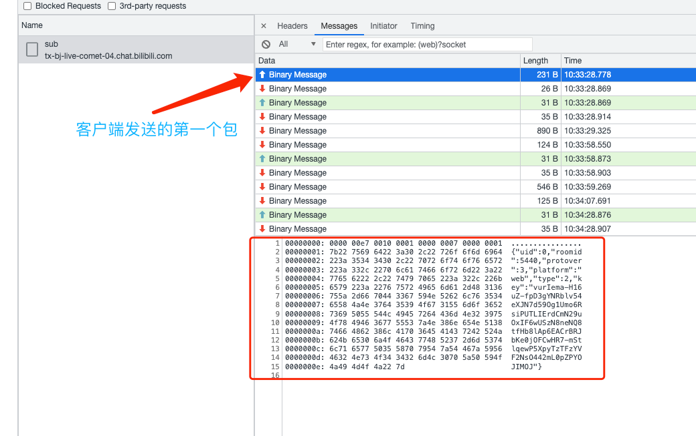
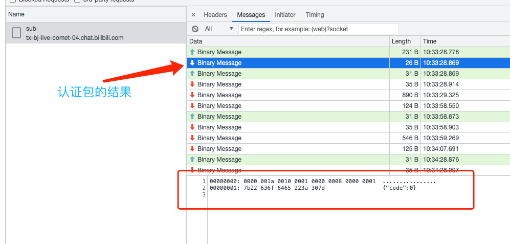
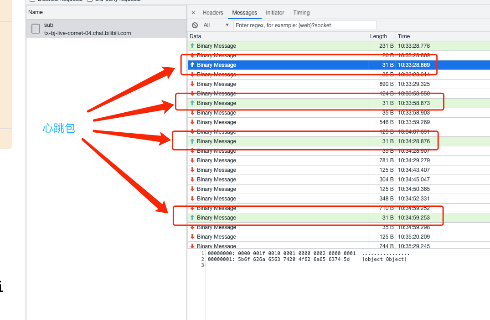
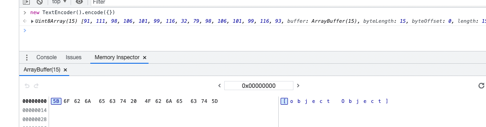
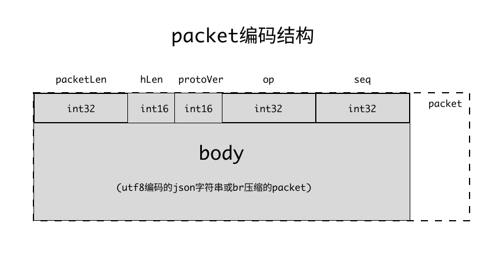
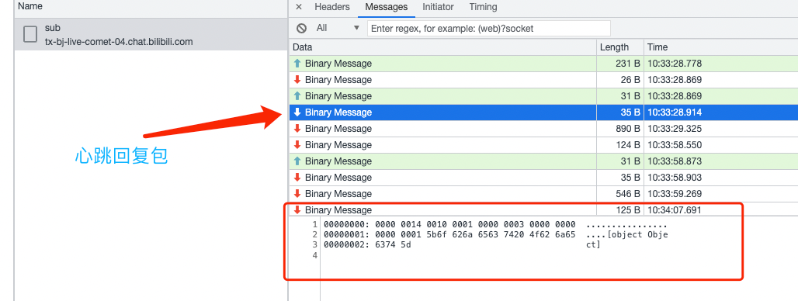

# B站直播间数据传输协议细节

> 以下内容来自于对B站官方脚本的分析，脚本地址:  
> https://s1.hdslb.com/bfs/blive-engineer/live-web-player/room-player.min.js
>
> 脚本最后更新时间: 2023-08-22 11:54:39 (Last-Modified)  
> 脚本版本: 1.4.5.41

首先根据房间号调用 HTTP 接口 `https://api.live.bilibili.com/xlive/web-room/v1/index/getDanmuInfo?id=${房间id}&type=0` 获取 `token`、`host_list`等建立 websocket 连接所需的基本参数。

`host_list`是 websocket 中断后进行重连的一个服务地址列表，接口会返回2个随机地址加1个固定地址: `broadcastlv.chat.bilibili.com`。

`token`用于 websocket 连接建立之后进行用户认证，只有认证成功才会接收到数据。

下面是接口返回的示例：

```json
{
  "code": 0,
  "message": "0",
  "ttl": 1,
  "data": {
    "group": "live",
    "business_id": 0,
    "refresh_row_factor": 0.125,
    "refresh_rate": 100,
    "max_delay": 5000,
    "token": "t_E3lrIA1UuNvoz-NbFUN-h2P8Gw75hyBqpd_7bwSKKcMq6mfkTyfPhAummm4KSxdJxoXOxswzQHDMYQODTXqDgJM0qixkFcvzPmCUWQzLFDkK8PeDK4VqBcmLCD0kiYz9WZQLELZn1J5Wwg9pxVJa5-un5J2gOJgMfB7EJnlQ0CLg==",
    "host_list": [
      {
        "host": "ks-live-dmcmt-sh2-pm-03.chat.bilibili.com",
        "port": 2243,
        "wss_port": 443,
        "ws_port": 2244
      },
      {
        "host": "ks-live-dmcmt-sh2-pm-01.chat.bilibili.com",
        "port": 2243,
        "wss_port": 443,
        "ws_port": 2244
      },
      {
        "host": "broadcastlv.chat.bilibili.com",
        "port": 2243,
        "wss_port": 443,
        "ws_port": 2244
      }
    ]
  }
}
```

有了`token`和 ws 地址，我们就可以建立 websocket 连接了，websocket 内部传输的数据为二进制 buffer 格式的数据，会经过下面这样的方式进行编码：

```js
// TextEncoder 默认是 UTF-8 编码
const body = new TextEncoder().encode(payload)
```

建立 websocket 连接之后，客户端需要发送 【Token认证包】进行认证，只有认证通过之后才能进行后续的通信。认证包采用的是 json 格式，如下所示：



前16个字节是消息头，后面会讲。接下来就是一个 json 字符串，结构为:

```json5
{
  // 用户id，为0时表示没有登录
  "uid": 0,
  // 房间id
  "roomid": 5440,
  // 协议版本，目前为3
  "protover": 3,
  // 所在平台，浏览器的话就是web
  "platform": "web",
  // 固定为2，目的不详
  "type": 2,
  // 上一步拿到的token
  "key": "",
}
```

如果认证成功，服务器会返回下面这样的包：



前16个字节同样是消息头，接下来是一个 json 字符串表示结果。`code`为 0 表示成功。

> 在实际测试过程中，如果认证失败，服务器不会回复任何消息

到这里，websocket 连接就算建立起来了。
接下来会设置一个定时器，每隔30秒发送一个心跳包：



因为心跳包会发送一个空对象`{}`，而这个空对象经过上面的编码之后会变成：



所以才会出现上面那些心跳包的数据部分都是`[object Object]`这个字符串。

接下来是时候讲一下消息头的格式了

### 二进制消息协议

B站弹幕 websocket 传输的数据为二进制格式，如下所示：

```js
const ws = new WebSocket(url)
ws.binaryType = "arraybuffer"
```

### 消息(packet)编码结构



如上图所示，整个消息分为消息头 header 和消息体 body，header 部分占用16字节，内部包含5个字段：

```ts
interface PacketHeader {
    // 整个消息(包含header和body)所占字节数
    packetLen: int32

    // 消息头所占字节数，固定为16
    headerLen: int16

    // 协议版本，主要指body的压缩格式，取值为[0, 1, 3]
    // - 0表示业务通信消息，无压缩
    // - 1表示连接通信消息，无压缩 (比如心跳包、认证包等与业务无关的数据包)
    // - 3表示 Brotli 压缩，也就是浏览器中常见的 br 压缩算法
    protoVersion: int16

    // 操作码，当前共有5种操作码，见下面的 【操作码类型】
    op: int32

    // 消息序列号
    // 客户端发给服务器的包为1
    // 服务器发给客户端的包不确定
    seq: int32
}
```

> 关于压缩算法：
>
> 大部分现代浏览器都支持3种压缩算法：gzip / deflate / br  
> br 就指的是 Brotli 算法，这3种算法的比较可以阅读[这篇文章](https://www.siteground.com/blog/brotli-vs-gzip-compression/)

### 操作码类型

```js
const OPCODE = {
    // 心跳包
    WS_OP_HEARTBEAT: 2,

    // 心跳应答包
    WS_OP_HEARTBEAT_REPLY: 3,

    // 消息包
    WS_OP_MESSAGE: 5,

    // 用户认证包
    WS_OP_USER_AUTHENTICATION: 7,

    // 认证结果包
    WS_OP_CONNECT_SUCCESS: 8,
}
```

如果你仔细研究过ws里面传输的数据细节的话，可能会发现【心跳应答包】有一些特殊，如下所示：



这个结果其实是不满足上面的编码结构的，根据上面的编码结构解析 header 如下：

```json5
{
  packetLen: 20,
  headerLen: 16,
  protoVersion: 1,
  op: 3,
  seq: 0,
}
```

包总大小为20字节，但实际传输的却是35个字节。

我们根据上面心跳包知道，这个数据最后的`[object Object]`是服务器返回了一个空对象`{}`导致的。而 body 的前4个字节表示的当前房间的人气值(猜的)。

另外，消息头加上这个人气值正好是20字节，也就是`header.packetLen`值，也就是说，心跳应答包其实不需要返回后面的空对象的(浪费15个字节的传输流量)。

### 消息体(body)编码结构

根据上面可知，body 分压缩和无压缩2个版本，其中无压缩的 body 编码格式为 UTF-8 编码的 JSON 字符串，Brotli 压缩版是在无压缩版的基础上进行的封装。

另外，一次传输的 buffer 可以编码多个 packet。

.svg)

.svg)
