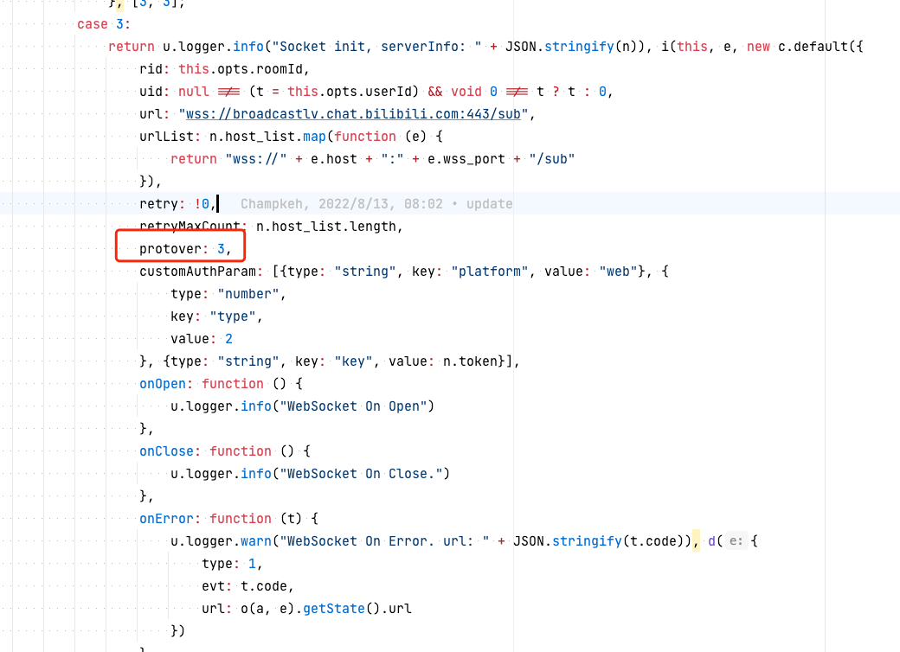
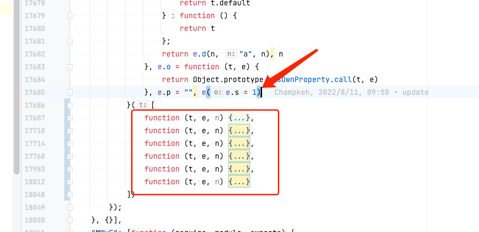

# 分析记录

## 关于文件名

socket 目录下的文件名格式为 `ModuleID.ModuleName.js`，对应`room-player.min.js`中相关模块的代码。

## 关于研究对象

`room-player.min.js`中关于 WebSocket 的模块总共有 2 个：

- EfpE: 封装 WebSocket 连接的核心包
- MWvE: 采用上面的包连接弹幕服务器

我们主要关注这 2 个模块。`MWvE`用来关注协议是否升级，`EfpE`用来关注 WebSocket 连接细节。

## 分析结果

`MWvE`模块我们关注协议版本是否发生变化，以及其他一些连接参数是否有改动，如下图所示：


目前弹幕协议版本为 3

`EfpE`模块主要关注websocket 连接细节，如下图所示，入口为索引1的函数：


这6个函数的说明：

- 0：ws 连接用到的一些常量
- 1：入口(直接导出2)
- 2：入口(包含一些构建信息)
- 3：ws 连接核心代码
- 4：ws 消息头的编码结构配置
- 5：工具类

当前分析的代码的构建信息如下：
```json5
{
  version: "1.4.5", 
  gitHash: "cbde3454",
  build: "41",
  bundleType: "release",
}
```
